# Blockchain Full-Stack AI Engineer

> The sky has no limits. Why limit yourself

Building high-performance decentralized applications with a deep focus on smart contracts, DeFi, and scalable backend systems.

## About

My passion lies in **DeFi protocol architecture**, **smart contract integration**, and **high-throughput backend systems** and bridging **AI**, **blockchain**, and **real-world data** to create full-stack decentralized applications that scale.

## Featured Projects

### AI Agents & Automation

#### 🤖 AgentiPy

<table>
<tr>
<td width="60%">

The Python toolkit for connecting AI agents to any onchain app. Open-source framework that enables AI agents to seamlessly perform on-chain actions on Solana and Base, bringing blockchain power to AI automation.

**Tech Stack:** Python, Solana, OpenAI, LLM, Node.js

**Stats:** 10.5k+ Downloads | 262 Stars | 100 Forks

🔗 [Live Demo](https://agentipy.fun/)

</td>
<td width="40%">

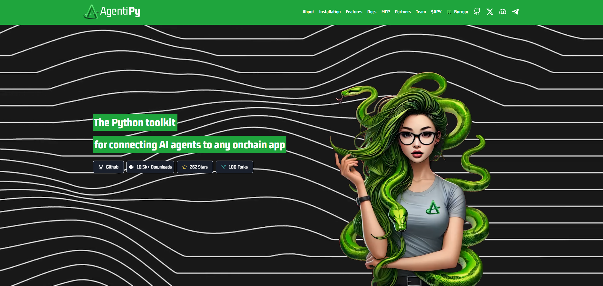

</td>
</tr>
</table>

---

#### 🎯 Ocoya

<table>
<tr>
<td width="60%">

N8N but for social media. Don't hire a social media agency - content creation and engagement with AI agents and workflows. Trusted by 532,865+ customers worldwide. Features automation templates, scheduling, and AI-powered content generation.

**Tech Stack:** Next.js, WebSocket, MongoDB, Python

**Features:** AI Workflows | Content Automation | Social Media Scheduling | Agency Tools | Multi-platform Integration

🔗 [Live Demo](https://www.ocoya.com/)

</td>
<td width="40%">

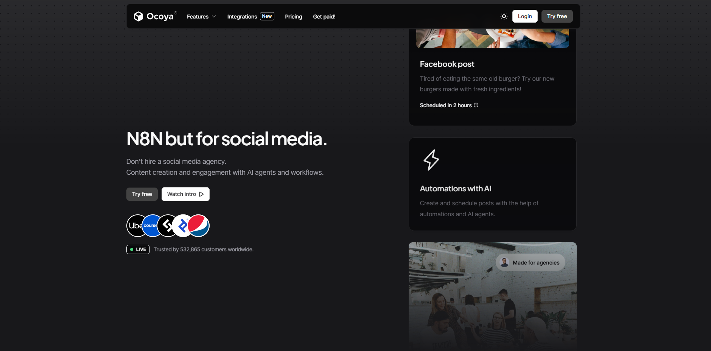

</td>
</tr>
</table>

---

#### ⛓️ Onyx AI Agent (EVM AI Agent)

<table>
<tr>
<td width="60%">

AI-powered DeFi platform that simplifies blockchain interactions across multiple networks. Connect your wallet and execute operations like checking balances, deploying smart contracts, launching tokens, and swapping assets using natural language. Supports Arbitrum, Avalanche, BNB Chain, Ethereum, Polygon, Solana, Linea, Optimism, and Base.

**Tech Stack:** EVM, Node.js, MongoDB, AI, TypeScript

**Features:** Multi-chain Support | Wallet Integration | Smart Contract Deployment | Token Launch | Asset Swapping | Chat Interface

🔗 [Live Demo](https://ai.onyx.org)

</td>
<td width="40%">

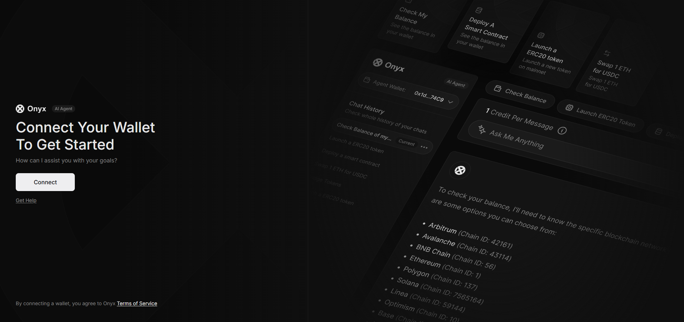

</td>
</tr>
</table>

### Blockchain Games

#### 🐍 Slither Game

<table>
<tr>
<td width="60%">

Skill-based multiplayer game with real-time gameplay, live leaderboards, and Solana wallet integration. Features customizable characters, entry fee system, and play-to-earn mechanics. High-performance architecture delivers smooth, addictive gameplay.

**Tech Stack:** Node.js, MongoDB, Solana, TypeScript

**Features:** Live Leaderboard | Wallet Integration | Customizable Appearance | Entry Fee System

🔗 [Live Demo](https://pvplabs.xyz/)

</td>
<td width="40%">

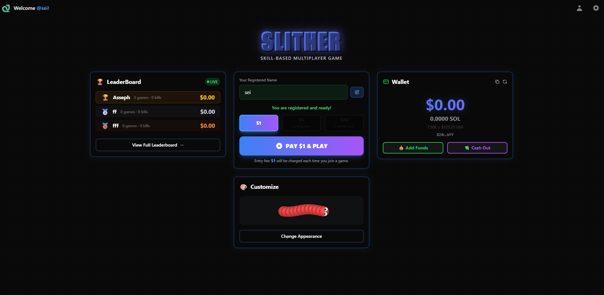

</td>
</tr>
</table>

---

#### 🎰 GGsol Game

<table>
<tr>
<td width="60%">

Cryptocurrency-themed online casino game with provably fair system, real-time betting, and live chat. Features coin-flip mechanics, round history tracking, XP system, and Solana wallet integration. Blends regulatory compliance, advanced security, and seamless performance.

**Tech Stack:** React, TypeScript, Solana, Node.js

**Features:** Provably Fair System | Real-time Betting | Live Chat | XP & Rewards System | Round History

🔗 [Live Demo](https://ggsol.io/)

</td>
<td width="40%">

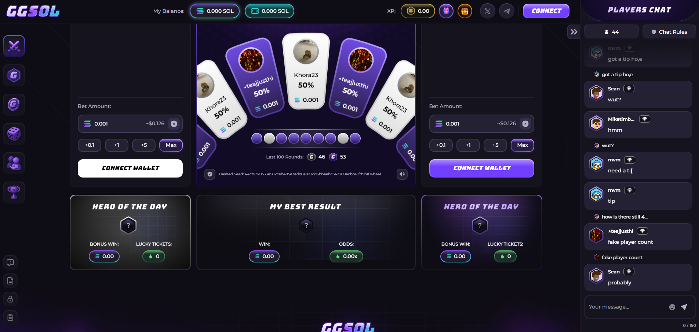

</td>
</tr>
</table>

---

#### 🎲 Luck Game (LUCK.IO)

<table>
<tr>
<td width="60%">

Comprehensive DeFi casino platform featuring multiple classic games including Mines, Dice, Crash, Plinko, Coinflip, Roulette, and more. Fully transparent with $9M+ bankroll, $948M+ total wagered, 201M+ bets, and 98.61% Net RTP. Features instant settlement through smart contracts, provably fair gaming, private play (no KYC), and self-custody wallet integration.

**Tech Stack:** TypeScript, React Vite, Node.js, MongoDB

**Features:** Multiple Game Modes | Provably Fair | Instant Settlement | Live Payout Tracking | High RTP Rates (98%+) | Wallet Integration | Gem Collection | Blockchain Explorer

🔗 [Live Demo](https://luck.io/)

</td>
<td width="40%">

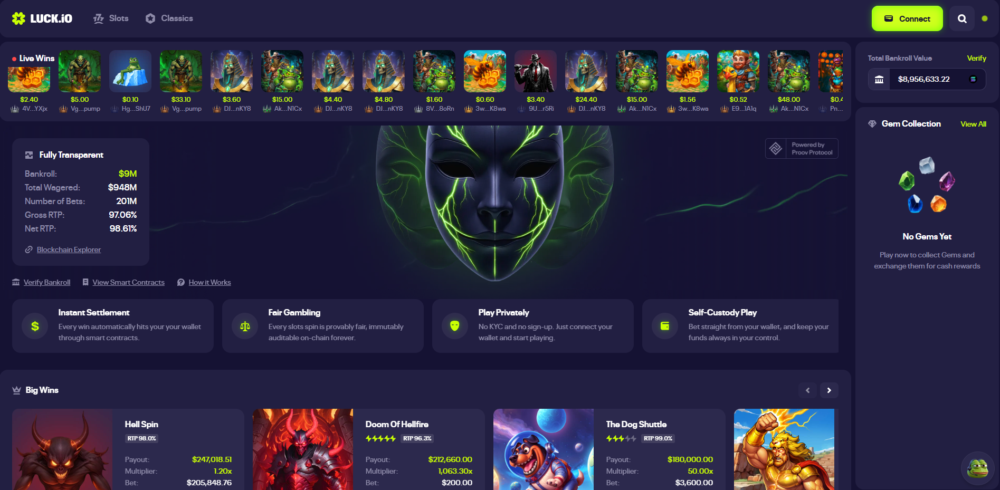

</td>
</tr>
</table>

---

#### ⛏️ Bitcoin Mining Game (The Rune Guardians: Chronicles of Midgard)

<table>
<tr>
<td width="60%">

Fantasy-themed Bitcoin mining game set in the realm of Midgard. Explore six enchanting regions, mine rare runes and precious materials while circling the majestic Rune Castle. Balanced in-game economics and engaging gameplay that reflects real mining dynamics.

**Tech Stack:** React, BTC, Node.js, MongoDB

**Features:** Multiple Regions | Rune Mining | Material Collection | Bitcoin Wallet Integration | Fantasy World

🔗 [Live Demo](https://theruneguardians.com/)

</td>
<td width="40%">

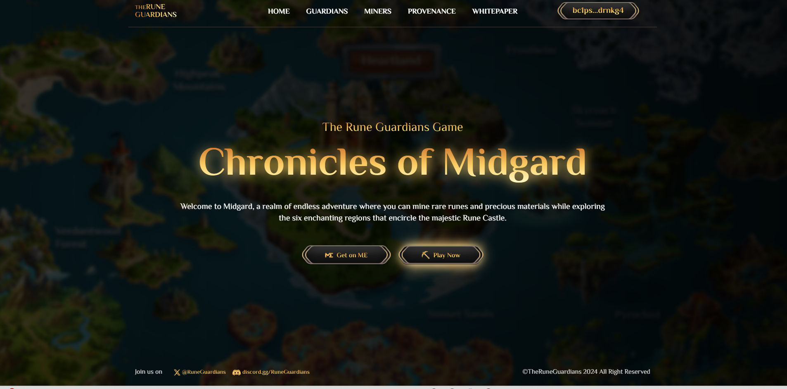

</td>
</tr>
</table>

### Full-Stack AI Applications

#### 📄 ChatDOC

<table>
<tr>
<td width="60%">

AI-powered tool designed to help users interact with documents in a simple and efficient way. Ask questions, extract information, and analyze documents with AI.

**Tech Stack:** Next.js, MongoDB, AI, Python

🔗 [Live Demo](https://chatdoc.com/)

</td>
<td width="40%">

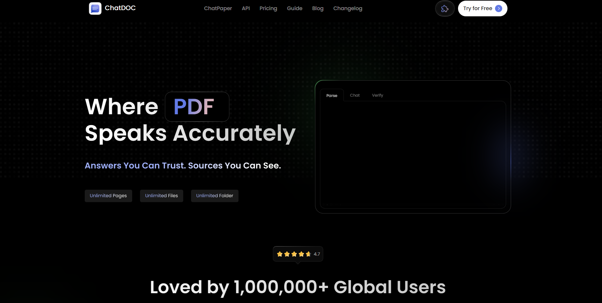

</td>
</tr>
</table>

---

#### 🎬 StoryFile

<table>
<tr>
<td width="60%">

AI-powered video platform featuring volumetric video capture technology. A StoryLine is a set of questions that guide users through interactive video experiences. Professional production setup with advanced motion capture capabilities for immersive storytelling.

**Tech Stack:** React Vite, Node.js, Python, MongoDB

**Features:** Volumetric Video Capture | Interactive Storylines | Motion Capture | Professional Production Tools

🔗 [Live Demo](https://storyfile.com/)

</td>
<td width="40%">

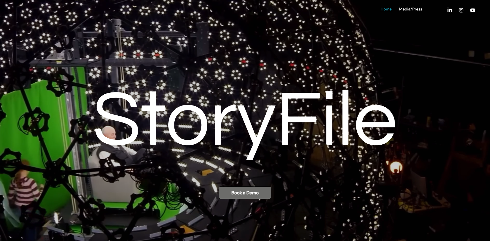

</td>
</tr>
</table>

---

#### 📝 Free Resume Builder (CVJury)

<table>
<tr>
<td width="60%">

Online resume builder that opens doors. Empower your job hunt with one powerful platform. Get everything you need to land more interviews - resume and cover letter builder, scanner, LinkedIn optimizations, and professional resume review by certified experts.

**Tech Stack:** React Vite, Python, MongoDB, Node.js, AI

**Features:** Resume Builder | Cover Letter Builder | LinkedIn Optimization | Resume Scanner | Professional Review | CV Templates

🔗 [Live Demo](https://cvjury.com/)

</td>
<td width="40%">

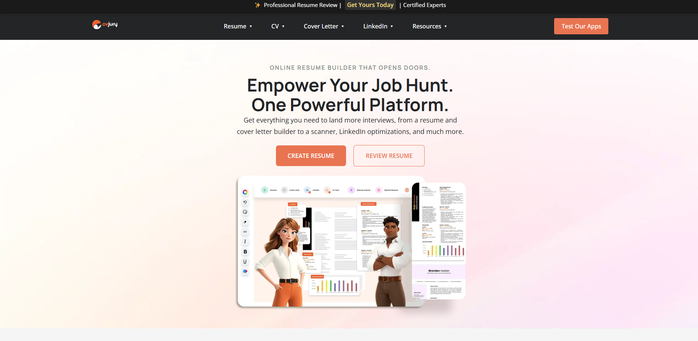

</td>
</tr>
</table>

---

#### 🎨 Sintra

<table>
<tr>
<td width="60%">

Modern product platform featuring interactive 3D characters and immersive user experiences. Clean, futuristic design with engaging UI/UX.

**Tech Stack:** React vite, Node.js, AI, Python, PostgreSQL

**Features:** 3D Character Integration | Modern UI/UX | Interactive Design

🔗 [Live Demo](https://sintra.ai/soshie)

</td>
<td width="40%">

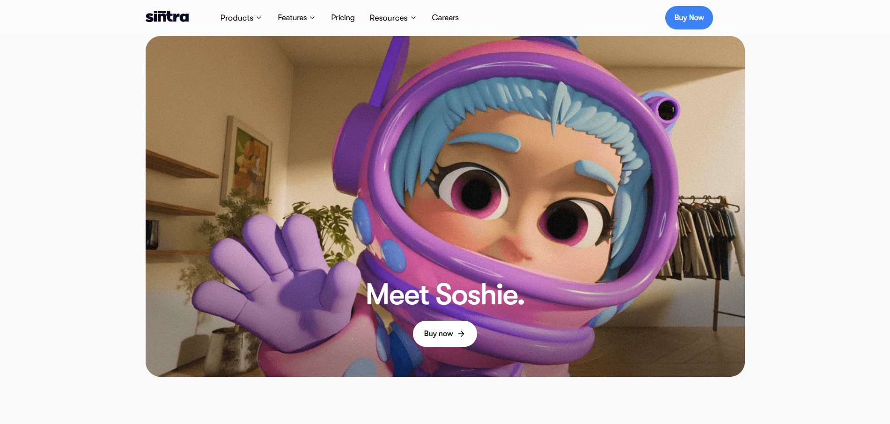

</td>
</tr>
</table>

### Blockchain Infrastructure

#### 💼 BlockAI

<table>
<tr>
<td width="60%">

Cutting-edge market making & launch services since 2018. Professional DeFi services platform providing comprehensive market making solutions and token launch services for blockchain projects.

**Tech Stack:** React, Node.js, Web3

**Features:** Market Making Services | Token Launch Services | DeFi Solutions | Professional Consulting

🔗 [Live Demo](https://blockai.com)

</td>
<td width="40%">

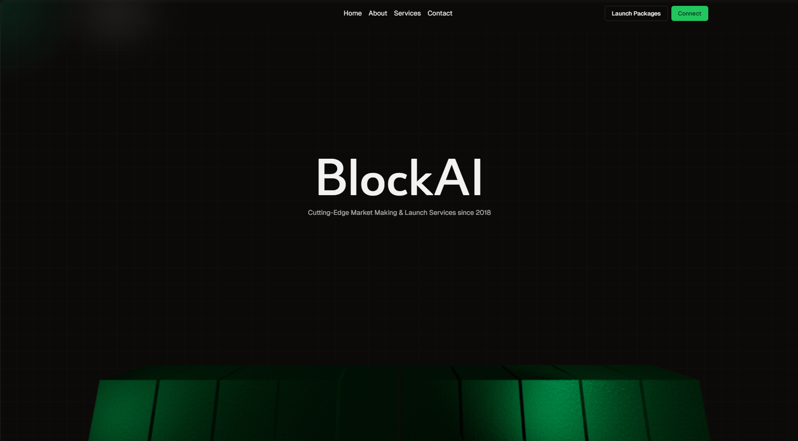

</td>
</tr>
</table>

---

#### 🚀 Agents.Land (Memecoin Launchpad)

<table>
<tr>
<td width="60%">

Take your agent to the promised land. Next-generation token launchpad platform featuring live token tracking, subscription system, and DEX listings. Built for both Solana and EVM-compatible chains, designed to make launching tokens fast, fair, and fun. Features real-time market cap tracking, token analytics, and gamified pixel art interface.

**Tech Stack:** Next.js, Solana, MongoDB, EVM, Web3

**Features:** Token Launch | Live Tracking | Subscription System | DEX Listings | Market Analytics | Strongbox Vault | Campaign Management

🔗 [Live Demo](https://agents.land/)

</td>
<td width="40%">

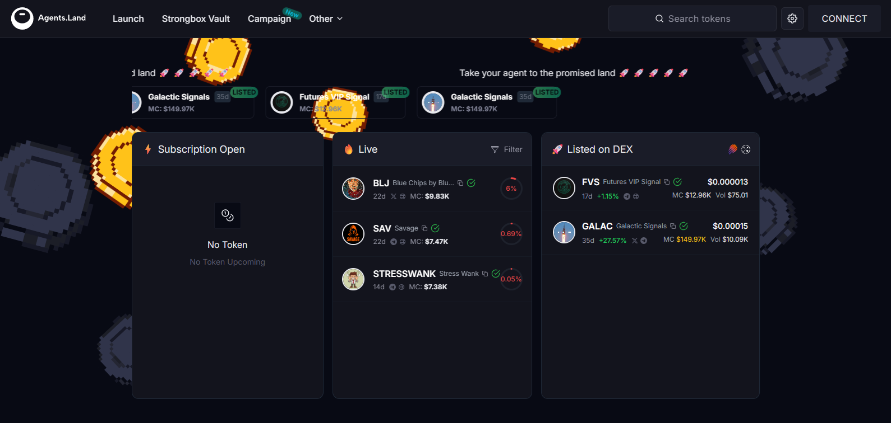

</td>
</tr>
</table>

## Skills

**Languages:**     

**Blockchain:**       

**Backend:**     

**Frontend:**    

**Databases:**   

**Tools:**     

---

## 💬 Let's Connect

**Open to collaboration, consulting, and exciting new projects**

**Reach out via Telegram or X for project inquiries, partnerships, or just to say hello!**

